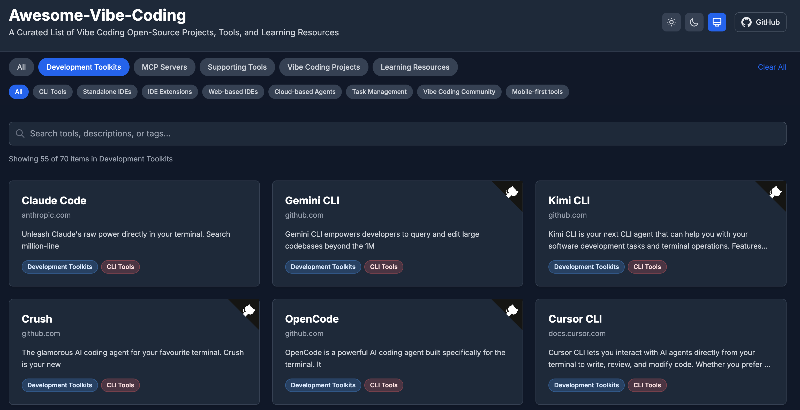
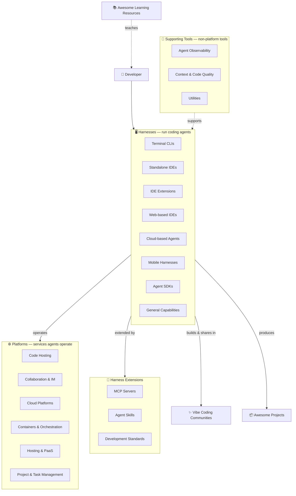

# Awesome-Vibe-Coding

[](https://0xWelt.github.io/Awesome-Vibe-Coding/)
[](https://github.com/0xWelt/Awesome-Vibe-Coding)
[](https://github.com/0xWelt/Awesome-Vibe-Coding/fork)
[](https://creativecommons.org/licenses/by/4.0/)
[](https://awesome.re)

A Curated List of Vibe Coding Open-Source Projects, Tools, and Learning Resources

🌐 **Live Website**: [https://0xWelt.github.io/Awesome-Vibe-Coding/](https://0xWelt.github.io/Awesome-Vibe-Coding/)



> **Content structure**: tools are organized in the [`contents/`](contents/) directory — one
> markdown file per tool, grouped by category and subcategory, with `_meta.md`
> files describing each folder. The live website is generated from these files
> by `yaal/scripts/parse-readme.js`.
## Architecture

The vibe coding ecosystem, from running agents to the services they operate, the
capabilities that extend them, and what they produce.



## Categories


| Category | Description | Location |
| --- | --- | --- |
| Harnesses | Tools that run AI coding agents — terminal CLIs, standalone IDEs, IDE extensions, web-based IDEs, cloud agents, mobile apps, SDKs, and their general capabilities (plan, goal, compact, PTC, hooks). | [contents/harnesses/](contents/harnesses/) |
| Vibe Coding Communities | Create apps with AI and share them with the community — AI app builders and remixable creation platforms. | [contents/vibe-coding-community/](contents/vibe-coding-community/) |
| Platforms | Platforms that provide services — code hosting, collaboration, cloud, hosting, project and task management — together with the CLIs (gh, glab, aws, lark-cli) that operate them. | [contents/platforms/](contents/platforms/) |
| Harness Extensions | What extends coding agents beyond the box — standards & protocols (AGENTS.md, MCP, ACP, Skills), MCP servers, and agent skills. | [contents/harness-extensions/](contents/harness-extensions/) |
| Supporting Tools | Non-platform tools that support agent workflows — observability, context preparation, code quality, and specialized utilities. | [contents/supporting-tools/](contents/supporting-tools/) |
| Awesome Projects | Projects created through vibe coding. | [contents/awesome-projects/](contents/awesome-projects/) |
| Awesome Learning Resources | Essential courses and educational resources to master vibe coding. | [contents/awesome-learning-resources/](contents/awesome-learning-resources/) |

## Adding a Tool

To add a tool, create a markdown file in the matching `contents/` folder:

```markdown
---
name: Tool Name
link: https://example.com
command: tool-cmd        # optional
---

Short description of the tool.
```

The tool is picked up automatically when the website builds. Prefer adding a
separate file over editing an existing one — it keeps PRs small and conflict-free.

## Repo Status


## Contributors

This project exists thanks to all the people who contribute.

<a href="https://github.com/0xWelt/Awesome-Vibe-Coding/graphs/contributors">
  
</a>

## Star History

[](https://star-history.com/#0xWelt/Awesome-Vibe-Coding&Date)

## License

[](https://creativecommons.org/licenses/by/4.0/)

This work is licensed under a
[Creative Commons Attribution 4.0 International License](http://creativecommons.org/licenses/by/4.0/).
